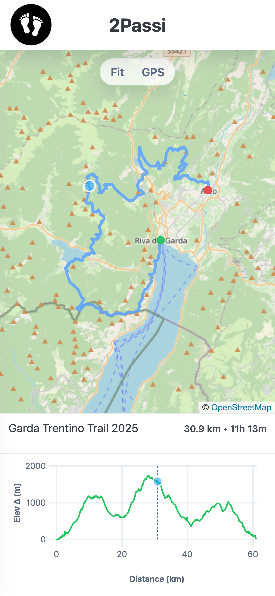

  

<h1 align="center">2Passi</h1>

  Offline-first GPX viewer PWA with map + elevation chart.
  No backend: your data stays on your device.

## Key features
- GPX import + track history
- Synced marker between map and elevation chart (drag from the chart)
- GPS with “snap to track” when you’re close
- Offline maps cache with storage cleanup
- Metric/imperial units + track renaming

## Quick start
1. Open the menu → import a `.gpx` file or pick one from history.
2. Drag on the elevation chart to move the marker.
3. Enable GPS to see your position and (if close) snap to the track.
4. In Settings you can change units and manage offline map cache.

 

  

